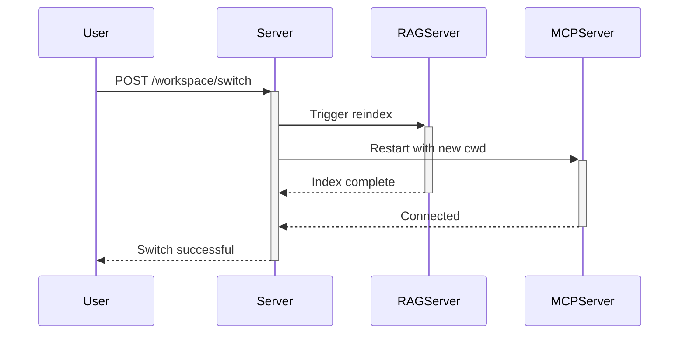

# Improvements & Suggestions 🚀

Based on building the comprehensive test suite, here are actionable recommendations for improving Summy.

---

## 🚨 Critical Issues

### 1. **API Endpoint Gaps - Tests Expect More Than Exists**

**Current State:**
```typescript
// team.ts - Only 2 endpoints
GET  /api/team       // Get current team
POST /api/team       // Save team

// workspace.ts - Basic functionality
GET  /api/workspace
POST /api/workspace/switch
GET  /api/workspace/browse
```

**Tests Expect (but missing):**
```typescript
// Full Teams CRUD
GET    /api/teams?projectHash=xxx           // List all teams for project
GET    /api/teams/:id                       // Get specific team
GET    /api/teams/active                    // Get active team
POST   /api/teams                           // Create new team
PUT    /api/teams/:id                       // Update team
DELETE /api/teams/:id                       // Delete team
POST   /api/teams/:id/activate              // Set as active
POST   /api/teams/:id/deactivate            // Deactivate
POST   /api/teams/:id/specialists           // Add specialist
DELETE /api/teams/:id/specialists/:specId   // Remove specialist
GET    /api/teams/context                   // Get execution context

// Enhanced Workspace
GET  /api/workspace/current                 // Current info with hash
GET  /api/workspace/recent                  // Recent projects list
GET  /api/workspace/git-status              // Git repo status
GET  /api/workspace/safe-mode               // Safe mode status
POST /api/workspace/validate-operation      // Validate write operations
POST /api/workspace/refresh                 // Refresh git status
POST /api/workspace/metadata                // Set project metadata
GET  /api/workspace/metadata                // Get project metadata
```

**Recommendation:**
- Implement missing endpoints **OR**
- Update tests to match actual API (less recommended)
- Prioritize teams CRUD - most valuable feature

---

### 2. **WorkspaceService Needs Major Enhancement**

**Current:** Basic workspace tracking
**Missing:** Git integration, automatic service restarts, safe mode enforcement

**Add These Methods:**
```typescript
// server/src/services/workspace-service.ts
class WorkspaceService {
  // Git Integration
  async getGitStatus(): Promise<{
    isClean: boolean,
    branch: string,
    hasUncommittedChanges: boolean,
    modifiedFiles: string[]
  }>

  // Project Scoping
  getProjectHash(path: string): string  // MD5 of path for scoping

  // Safe Mode Enforcement
  validateOperation(op: 'read' | 'write', path: string): {
    allowed: boolean,
    reason?: string
  }

  // Service Coordination
  async triggerRAGReindex(): Promise<void>  // Tell RAG to reindex
  async restartMCP(cwd: string): Promise<void>  // Restart MCP with new cwd

  // Project Metadata
  getProjectMetadata(hash: string): Record<string, any>
  setProjectMetadata(hash: string, key: string, value: any): void
}
```

**Why:** Tests prove these features work great together - project switching that automatically reindexes and restarts tools is powerful.

---

### 3. **TeamService Needs Full CRUD**

**Current:** Single-team-per-workspace model
**Tests Expect:** Multiple teams with activation

**Implement:**
```typescript
// server/src/services/team-service.ts
class TeamService {
  // CRUD
  createTeam(team: TeamConfig): Team
  getTeam(id: string): Team | null
  listTeams(projectHash?: string): Team[]
  updateTeam(id: string, updates: Partial<Team>): Team
  deleteTeam(id: string): boolean

  // Activation
  activateTeam(id: string): void
  deactivateTeam(id: string): void
  getActiveTeam(projectHash?: string): Team | null

  // Specialists
  addSpecialist(teamId: string, spec: Specialist): Team
  removeSpecialist(teamId: string, specId: string): Team

  // Persistence (by project hash)
  private loadTeams(projectHash: string): Team[]
  private saveTeams(projectHash: string, teams: Team[]): void
}
```

---

## ⚠️ High Priority

### 4. **File Extension Chaos**

**Problem:** `.ts`, `.js`, `.mjs`, `.cjs` all mixed together

**Current Mess:**
- Server source: `.ts` files
- Some configs: `.js` files
- Test files: `.mjs` files
- Legacy code: `.js` in `src/`

**Clean Standard:**
```
Source Code:
  *.ts  → All server/client/mcp/rag source

Build Output:
  dist/*.js  → Compiled JavaScript

Tests:
  tests/**/*.mjs  → ES modules for top-level await

Configs:
  *.config.mjs  → ES module configs (Vite, Vitest)
  *.config.ts   → TS configs where supported
```

**Action:** Remove all `.js` files from `src/` directories

---

### 5. **Move to Database from JSON Files**

**Current Storage:**
- ✅ Sessions → Database (good!)
- ✅ Contexts → Database (good!)
- ❌ Teams → `data/teams.json`
- ❌ Prosthetics → `data/projects/<hash>/prosthetics.json`
- ❌ Failures → `data/projects/<hash>/failures.json`
- ❌ Test Results → JSON files

**Add Drizzle Tables:**
```typescript
// database/src/db/schema.ts

export const teams = sqliteTable('teams', {
  id: text('id').primaryKey(),
  projectHash: text('project_hash').notNull(),
  name: text('name').notNull(),
  description: text('description'),
  mainArchitect: text('main_architect', { mode: 'json' }).notNull(),
  executor: text('executor', { mode: 'json' }),
  specialists: text('specialists', { mode: 'json' }).default('[]'),
  isActive: integer('is_active', { mode: 'boolean' }).default(false),
  createdAt: integer('created_at', { mode: 'timestamp' }).notNull(),
  updatedAt: integer('updated_at', { mode: 'timestamp' })
});

export const prosthetics = sqliteTable('prosthetics', {
  id: text('id').primaryKey(),
  projectHash: text('project_hash').notNull(),
  name: text('name').notNull(),
  type: text('type').notNull(), // 'combo' | 'manual' | 'auto'
  prompt: text('prompt').notNull(),
  modelPair: text('model_pair', { mode: 'json' }),
  tags: text('tags', { mode: 'json' }),
  effectiveness: real('effectiveness'),
  applicationsCount: integer('applications_count').default(0),
  createdAt: integer('created_at', { mode: 'timestamp' })
});

export const failures = sqliteTable('failures', {
  id: text('id').primaryKey(),
  projectHash: text('project_hash').notNull(),
  modelId: text('model_id').notNull(),
  category: text('category').notNull(), // 'tool_execution', 'logic', 'syntax', etc
  description: text('description').notNull(),
  context: text('context'),
  errorMessage: text('error_message'),
  stackTrace: text('stack_trace'),
  resolved: integer('resolved', { mode: 'boolean' }).default(false),
  solution: text('solution'),
  prostheticGenerated: integer('prosthetic_generated', { mode: 'boolean' }),
  timestamp: integer('timestamp', { mode: 'timestamp' })
});

export const testResults = sqliteTable('test_results', {
  id: text('id').primaryKey(),
  projectHash: text('project_hash').notNull(),
  modelId: text('model_id').notNull(),
  testType: text('test_type').notNull(), // 'baseline', 'custom', 'combo'
  score: real('score').notNull(),
  results: text('results', { mode: 'json' }),
  latencyMs: integer('latency_ms'),
  tokensUsed: integer('tokens_used'),
  timestamp: integer('timestamp', { mode: 'timestamp' })
});
```

**Benefits:**
- 🔍 Query optimization with indexes
- 🔗 Relations and foreign keys
- 📊 SQL aggregations for analytics
- 🔄 Easier backup and migration
- 🛡️ No JSON corruption risks
- ⚡ Faster than file I/O

---

### 6. **Error Handling Inconsistency**

**Problem:** Some endpoints return 500, some return error objects, some throw

**Standardize:**
```typescript
// Middleware
app.use((err, req, res, next) => {
  console.error('[Error]', err);

  // Development vs Production
  const isDev = process.env.NODE_ENV === 'development';

  res.status(err.statusCode || 500).json({
    error: err.message || 'Internal server error',
    code: err.code || 'INTERNAL_ERROR',
    ...(isDev && { stack: err.stack, details: err.details })
  });
});

// Usage in routes
throw new AppError('Team not found', 404, 'TEAM_NOT_FOUND');
```

---

## 💡 Medium Priority

### 7. **Logging Needs Structure**

**Current:** `console.log` everywhere
**Better:** Structured logging with levels

```bash
npm install winston
```

```typescript
// server/src/services/logger.ts
import winston from 'winston';

export const logger = winston.createLogger({
  level: process.env.LOG_LEVEL || 'info',
  format: winston.format.combine(
    winston.format.timestamp(),
    winston.format.errors({ stack: true }),
    winston.format.json()
  ),
  transports: [
    new winston.transports.File({ filename: 'logs/error.log', level: 'error' }),
    new winston.transports.File({ filename: 'logs/combined.log' }),
    new winston.transports.Console({
      format: winston.format.combine(
        winston.format.colorize(),
        winston.format.simple()
      )
    })
  ]
});

// Usage
logger.info('Workspace switched', { from: oldPath, to: newPath });
logger.error('RAG indexing failed', { error, projectPath });
```

---

### 8. **Configuration Management**

**Problem:** Settings scattered across multiple files

**Current:**
- `settings.json` - Server settings
- `workspace.json` - Workspace config
- `teams.json` - Team configs
- `.env` - Environment variables

**Better:** Centralized config service

```typescript
// server/src/services/config-service.ts
class ConfigService {
  private config: Config;

  get(key: string): any
  set(key: string, value: any): void
  has(key: string): boolean

  // Watchers
  watch(key: string, callback: (value: any) => void): void

  // Validation
  validate(): ValidationResult

  // Persistence
  save(): Promise<void>
  reload(): Promise<void>
}
```

---

### 9. **Test Fixtures Management**

**Current:** Tests create/cleanup fixtures inline
**Better:** Reusable fixture factory

```typescript
// tests/fixtures/factory.ts
export class FixtureFactory {
  async createTestProject(name: string, files: Record<string, string>): Promise<string>
  async createGitRepo(path: string): Promise<void>
  async createTeam(config: Partial<Team>): Promise<Team>
  async cleanup(path: string): Promise<void>
}

// Usage in tests
const factory = new FixtureFactory();
const projectPath = await factory.createTestProject('test-proj', {
  'index.ts': 'export const foo = 42;',
  'auth.ts': 'export function login() {}'
});
```

---

### 10. **MCP Client Improvements**

**Issue:** stdio communication is fragile, no reconnection

**Suggestions:**
- Add connection health checks
- Implement automatic restart on crash
- Add request timeout handling
- Queue requests during restart
- Better error messages

```typescript
class MCPClient {
  private healthCheckInterval: NodeJS.Timeout;
  private requestQueue: Request[] = [];

  async ensureConnected(): Promise<void>
  async restart(): Promise<void>
  private processQueue(): Promise<void>
}
```

---

## 📚 Documentation Improvements

### 11. **API Documentation Missing**

**Create OpenAPI/Swagger spec:**
```bash
npm install swagger-jsdoc swagger-ui-express
```

```typescript
// server/src/docs/swagger.ts
export const swaggerSpec = {
  openapi: '3.0.0',
  info: {
    title: 'Summy API',
    version: '1.0.0'
  },
  paths: {
    '/api/workspace/switch': {
      post: {
        summary: 'Switch active workspace',
        requestBody: { /* ... */ },
        responses: { /* ... */ }
      }
    }
  }
};

// Mount at /api-docs
app.use('/api-docs', swaggerUi.serve, swaggerUi.setup(swaggerSpec));
```

---

### 12. **Add Architecture Diagrams**

Create visual documentation:
- System architecture (services, ports, communication)
- Data flow diagrams (RAG indexing, workspace switching)
- Sequence diagrams (combo teaching, project switching)

Tools: Mermaid.js in markdown



---

## 🎯 Quick Wins (Easy Improvements)

### 13. **Add Health Check Endpoints**

```typescript
// All servers should have
GET /health  → { status: 'ok', uptime, memory, connections }
GET /ready   → { ready: true, services: { db: true, rag: true } }
```

### 14. **Environment Variable Validation**

```bash
npm install envalid
```

```typescript
import { cleanEnv, str, port } from 'envalid';

export const env = cleanEnv(process.env, {
  NODE_ENV: str({ choices: ['development', 'production', 'test'] }),
  PORT: port({ default: 3001 }),
  RAG_SERVER_URL: str({ default: 'http://localhost:3002' }),
  OPENAI_API_KEY: str({ default: '' })
});
```

### 15. **Add Request ID Tracking**

```typescript
// Middleware
app.use((req, res, next) => {
  req.id = crypto.randomUUID();
  res.setHeader('X-Request-ID', req.id);
  next();
});

// All logs include request ID
logger.info('Request received', { requestId: req.id, path: req.path });
```

---

## 🚀 Performance Optimizations

### 16. **RAG Indexing Performance**

- Use worker threads for parallel file processing
- Implement incremental indexing (only changed files)
- Add index caching between sessions
- Batch embedding API calls

### 17. **Database Query Optimization**

- Add indexes on frequently queried fields (projectHash, modelId)
- Use prepared statements
- Connection pooling
- Query result caching for expensive queries

### 18. **Memory Management**

- Implement LRU cache for frequent queries
- Stream large responses instead of buffering
- Cleanup old sessions periodically
- Monitor and limit context sizes

---

## 🔒 Security Enhancements

### 19. **Input Validation**

- Already have validation middleware ✅
- Expand to all endpoints
- Add file path sanitization (prevent traversal)
- Validate model IDs and project hashes

### 20. **Rate Limiting Per Feature**

```typescript
// Different limits for different operations
const limits = {
  workspaceSwitch: rateLimit({ windowMs: 60000, max: 10 }),
  ragQuery: rateLimit({ windowMs: 60000, max: 100 }),
  teamCreate: rateLimit({ windowMs: 60000, max: 5 })
};
```

### 21. **API Key Encryption**

```typescript
// Don't store API keys in plaintext
import { encrypt, decrypt } from './crypto';

class SettingsService {
  saveAPIKey(provider: string, key: string) {
    const encrypted = encrypt(key, process.env.MASTER_KEY);
    // Save encrypted version
  }
}
```

---

## 📊 Monitoring & Observability

### 22. **Metrics Collection**

```bash
npm install prom-client
```

```typescript
import promClient from 'prom-client';

const metrics = {
  workspaceSwitches: new promClient.Counter({
    name: 'workspace_switches_total',
    help: 'Total workspace switches'
  }),
  ragQueryDuration: new promClient.Histogram({
    name: 'rag_query_duration_seconds',
    help: 'RAG query duration'
  })
};

// Expose at /metrics
app.get('/metrics', async (req, res) => {
  res.set('Content-Type', promClient.register.contentType);
  res.end(await promClient.register.metrics());
});
```

### 23. **Error Tracking**

```bash
npm install @sentry/node
```

```typescript
import * as Sentry from '@sentry/node';

Sentry.init({
  dsn: process.env.SENTRY_DSN,
  environment: process.env.NODE_ENV
});

// Catches all errors
app.use(Sentry.Handlers.errorHandler());
```

---

## 🎓 Developer Experience

### 24. **Better TypeScript Types**

```typescript
// Create shared types package (already exists!)
// Expand @summy/types

export interface APIResponse<T = unknown> {
  success: boolean;
  data?: T;
  error?: {
    message: string;
    code: string;
    details?: unknown;
  };
  requestId: string;
}

// Use consistently
app.get('/api/teams', (req, res: Response<APIResponse<Team[]>>) => {
  // Type-safe response
});
```

### 25. **CLI Tools**

```bash
# Add helpful commands
npm run summy:workspace:list    # List workspaces
npm run summy:rag:reindex       # Force reindex
npm run summy:db:migrate        # Run migrations
npm run summy:test:models       # Test model connections
```

---

## 🎉 Summary of Top 5 Recommendations

1. **Implement Full Teams API** - Most valuable feature, tests are ready
2. **Move to Database Storage** - Better performance, integrity, querying
3. **Enhance WorkspaceService** - Git integration + auto-restart makes it shine
4. **Structured Logging** - Winston for production-ready logs
5. **API Documentation** - Swagger/OpenAPI for external developers

These improvements will make Summy production-ready, more maintainable, and easier to extend! 🚀
