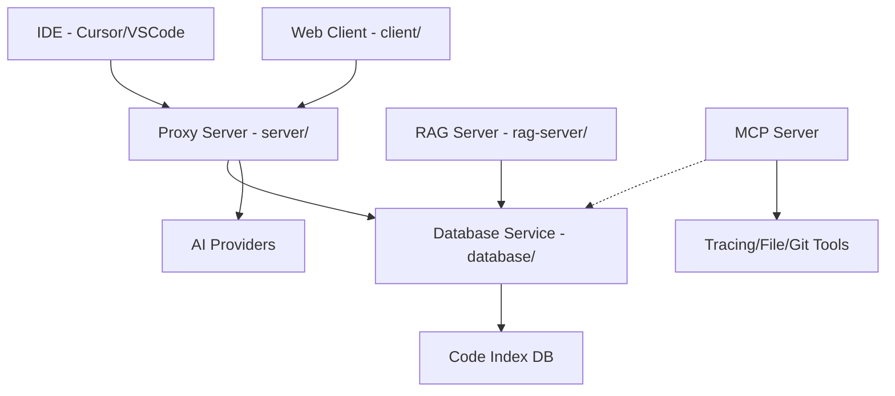

# Codebase Refactoring Plan: COMPLETED

## Overview
**Status:** ✅ **COMPLETE** (Dec 30, 2025)

The Summy codebase has been successfully transformed from a monolithic architecture to a modular, LLM-native system. All major objectives have been achieved.

## Achievements

### 1. File Splitting & Modularization
- **`server/src/index.ts`**: Reduced from ~2800 lines to ~360 lines. Routes are now modularized in `server/src/routes/`.
- **`Tooly.tsx`**: Split into a feature directory `client/src/pages/tooly/` with dedicated components, hooks, and sub-pages.
- **`test-engine.ts`**: Refactored into focused modules.

### 2. Infrastructure
- **Shared Types**: `packages/types` workspace established.
- **Database Service**: `database/` workspace created with Drizzle ORM and SQLite.
- **Dependency Graph**: Zero circular dependencies verified in the core codebase.

### 3. Code Index System (Phase 4)
- **AST Analysis**: Implemented robust parsing using `ts-morph` (`database/src/analysis/ast-parser.ts`).
- **Indexing Orchestrator**: `database/scripts/analyze-codebase.ts` scans and indexes the entire codebase.
- **Data Model**: SQLite tables `code_index`, `code_chunks`, and `code_dependencies` populated with rich metadata (exports, calls, dependencies).

### 4. Advanced MCP Tools (Phase 3)
- **Tracing Tools**: Implemented in `mcp-server/src/tools/tracingTools.ts`:
    - `trace_function`: Maps caller/callee relationships.
    - `find_components`: Semantic component search.
    - `read_component`: Context-aware reading (component + immediate deps).
- **Integration**: Tools are live and registered in the MCP server.

### 5. Validation (Phase 5)
- **Validation Script**: `database/scripts/validate-exports.ts` created.
- **Result**: Confirmed 0 circular dependencies in the main codebase.

## System Architecture (Final State)

## Next Steps (Maintenance)
- Run `npm run index:code` (via `database` workspace) periodically or on git hooks to keep the index fresh.
- Use `npm run validate` to ensure no new circular dependencies are introduced.